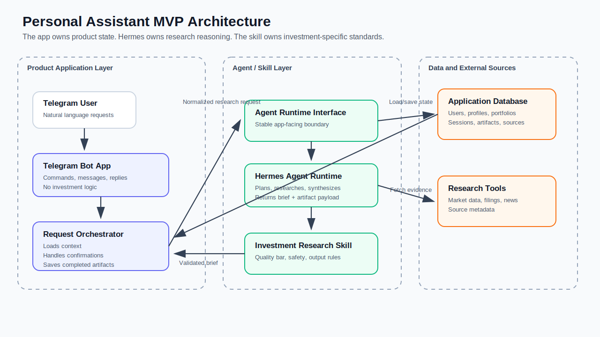
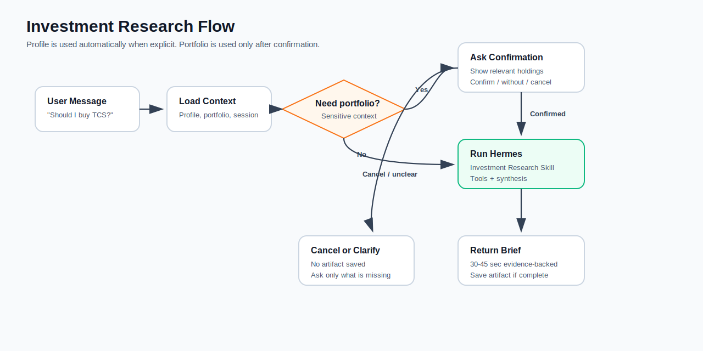

# Personal Assistant MVP — Architecture Design

## 1. Design Goal

The MVP must prove that a Telegram assistant can produce contextual, evidence-backed investment research without turning the core app into an investment-analysis engine.

The design follows one boundary:

**The application owns product state. Hermes owns research reasoning. The Investment Research Skill owns investment standards.**

## 2. Architecture

The product is split into three layers:

| Layer | Responsibility |
|---|---|
| Product application | Telegram UX, user identity, profile, portfolio, sessions, confirmations, artifact persistence |
| Agent and skill layer | Research planning, tool use, evidence synthesis, recommendation generation |
| Data and sources | User data, saved artifacts, market data, filings, news, source metadata |

Hermes is the first agent runtime. The app calls it through a small internal agent-runtime boundary so the product layer does not couple to Hermes-specific details.

Research flow:

## 3. Minimal Data Model

| Entity | Why It Exists |
|---|---|
| User | Maps Telegram identity to an internal user |
| Profile | Stores explicit durable user context |
| Portfolio | Stores saved holdings for optional confirmed use |
| Session | Stores temporary task and confirmation state |
| Research Artifact | Stores completed research output |
| Source | Stores evidence metadata for artifacts |

The MVP does not need a complex portfolio model, document embeddings, full source snapshots, or artifact versioning.

## 4. Requirement Mapping

| Requirement | Design Choice |
|---|---|
| Telegram-only interface | Telegram Bot App |
| One profile per user | Context Service, Database |
| Explicit profile only | Context Service |
| No inferred preferences | Context Service, Session Manager |
| One portfolio per user | Context Service, Database |
| Confirm portfolio before use | Portfolio Confirmation |
| User-controlled temporary context | Session Manager |
| Skill-based architecture | Agent Runtime Boundary, Hermes, Investment Research Skill |
| App should not hardcode investment logic | Request Orchestrator boundary |
| High-quality external research | Hermes, Research Tool Gateway |
| Evidence-backed brief | Hermes, Investment Research Skill, Output Validator |
| Suggested action and confidence | Investment Research Skill, Output Validator |
| Save completed research | Artifact Store |
| Prior retrieval out of scope | Artifact Store only, no retrieval UX |
| Safety boundaries | Investment Research Skill, Output Validator |

## 5. Hermes Boundary

The app gives Hermes:

| Input | Notes |
|---|---|
| User request | Original Telegram investment question |
| Profile | Included if available; explicit fields only |
| Portfolio | Included only after user confirms use |
| Session instructions | Temporary only |
| Constraints | India/US equities, allowed actions, confidence values, safety rules |

Hermes returns:

| Output | Notes |
|---|---|
| Status | Completed, needs clarification, out of scope, or failed |
| Telegram brief | Compact evidence-backed answer |
| Artifact payload | Present only for completed research |
| Sources | Structured source metadata |
| Diagnostics | Missing context or unavailable data, if relevant |

## 6. Key Decisions

| Decision | Rationale |
|---|---|
| Hermes-first, but behind an internal boundary | Lets us use Hermes now without locking the product layer to it |
| One broad Investment Research Skill | Keeps MVP simple and avoids app-level investment workflow branching |
| Profile used automatically | Profile is explicit durable context |
| Portfolio confirmed every time | Portfolio is sensitive and may be stale or surprising |
| Brief first, artifact second | User gets fast readable insight; system still preserves full research |
| Validator outside Hermes | App protects UX, safety, and persistence quality |

## 7. Next Steps

The next design step should be narrower:

1. Choose the first database and Telegram framework.
2. Define the exact tables.
3. Define the Hermes request and response shape.
4. Define the research tools Hermes can use.
5. Build the happy path: Telegram request to Hermes to brief to saved artifact.
