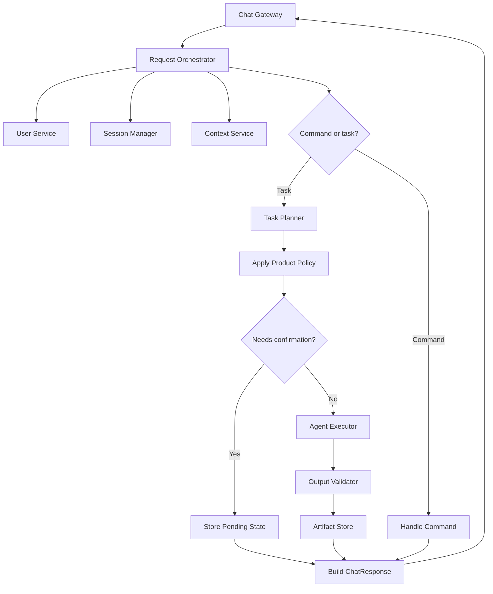

# 02. Request Orchestrator

## Purpose

Coordinates product workflow after the Chat Gateway normalizes input. It handles commands, session/pending state, planner handoff, executor handoff, validation handoff, artifact persistence, and chat-ready responses.

```text
Chat Gateway -> Request Orchestrator -> Task Planner -> Agent Executor
```

## Diagram



## Owns

- User resolution and command routing
- Session and pending-confirmation workflow
- Product policy enforcement before execution
- Planner, executor, validator, and artifact-store handoffs
- Returning `ChatResponse` objects to the gateway

## Does Not Own

- Telegram rendering
- Task interpretation or skill selection
- Investment reasoning or direct Hermes calls
- Research tool calls
- Durable memory inference
- Queueing, multi-user concurrency control, or scheduled automation

## Interfaces

- Gateway calls `handle_message(chat_message) -> chat_response`
- Gateway calls `handle_action(chat_action) -> chat_response`
- Orchestrator depends on `UserService`, `ContextService`, `SessionManager`, `TaskPlanner`, `AgentExecutor`, `OutputValidator`, and `ArtifactStore`
- Orchestrator returns chat-ready responses only; raw planner/executor/validator objects stay internal

## Policies

- Commands do not call planner or executor
- Natural language requests go through the Task Planner
- Planner recommends task type, skill, missing context, and context usefulness
- Orchestrator decides what context is allowed into execution
- Profile context may be included automatically because it is explicit durable context
- Portfolio context requires task-specific user confirmation
- Planner output is never final research
- Executor output must be validated before artifact persistence
- Invalid or failed outputs must not create completed artifacts
- First implementation stays in one Python service; no distributed queue or worker service

## Pending Confirmation

When portfolio context may be useful, store pending task state and return actions for:

- use portfolio
- continue without portfolio
- cancel

Confirm resumes with portfolio context. Skip resumes without it. Cancel clears pending state without execution.

## Acceptance Criteria

- Gateway uses one orchestrator interface for messages and actions
- Commands are deterministic and bypass planner/executor
- Natural language requests delegate skill selection to the planner
- Ready tasks delegate execution to the executor
- Portfolio context is never included without confirmation
- Pending confirmation state can be resumed or cancelled
- Completed results are validated before persistence
- Orchestrator contains no investment or Telegram rendering logic

## Implementation Notes

- Put orchestrator code in `src/orchestration/`
- Keep public methods to `handle_message(...)` and `handle_action(...)`
- Depend on interfaces for planner, context, session, executor, validator, and artifact store
- Build execution requests only after required user decisions are complete
- Keep portfolio confirmation as orchestrator-owned workflow state
- Use simple in-process dependencies first
- Unit tests should use fake dependencies for routing, confirmation, execution handoff, validation, and persistence behavior

