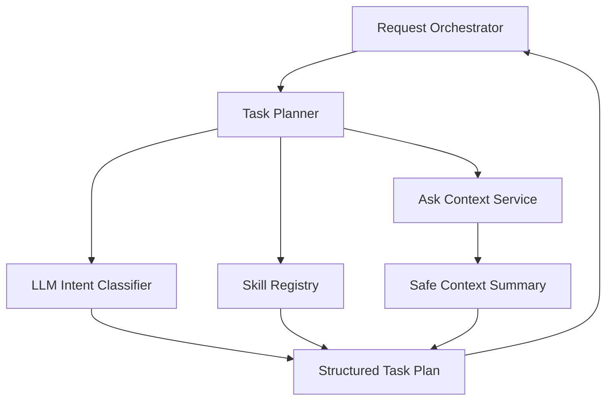

# 03. Task Planner

## Purpose

The Task Planner uses an LLM to classify user intent, select the right skill, and discover which personalization context may help the task.

It returns a structured plan to the Request Orchestrator. It does not execute the task or produce the final answer.

```text
Request Orchestrator
-> Task Planner
-> Structured Plan
-> Request Orchestrator
```

## Diagram



## Flow

The planner answers four questions:

1. What is the user trying to do?
2. Which skill should handle it?
3. What personal context might make the answer better?
4. Is anything missing before the task can continue?

When the planner needs context, it asks the Context Service for safe summaries. It does not read database tables directly. The planner may recommend using some context, but the Request Orchestrator decides what is actually allowed for execution.

## Responsibilities

- Classify user intent using an LLM
- Decide whether the request is supported
- Select the best skill for the request
- Identify useful personalization context
- Call approved read-only context APIs when context discovery is needed
- Detect missing context required for a useful answer
- Decide whether a clarification question is needed
- Return a structured plan to the Request Orchestrator

## Non-Responsibilities

- Task execution
- Final answer generation
- Direct Hermes execution
- Direct database access
- Durable memory writes
- Profile updates
- Portfolio authorization
- Chat rendering
- Artifact persistence

## Interfaces

The Request Orchestrator sends:

- normalized user request
- internal user identity
- active session summary when available
- allowed skill catalog
- context access policy

The planner may call approved read-only context APIs, such as:

- `get_user_profile_summary`
- `get_portfolio_availability`
- `get_portfolio_confirmation_summary`
- future domain summaries for shopping, travel, reminders, or other personal tasks

The planner returns a structured task plan with:

- plan status
- intent
- selected skill
- task type
- context used for planning
- context recommended for execution
- missing context
- clarification question when needed
- reason for unsupported requests when applicable

## Key Policies

- The planner may discover relevant context, but the orchestrator authorizes context use
- The planner must use app-approved context APIs instead of direct database queries
- Context APIs exposed to the planner must be read-only
- The planner may recommend portfolio context, but it must not authorize portfolio use
- The planner must not convert inferred preferences into durable memory
- The planner must not produce final research or shopping recommendations
- Planner output must be structured and validated before the orchestrator acts on it
- Unsupported requests should return a clear unsupported status, not a best-effort answer
- The planner should be designed for future skills such as shopping, travel, reminders, and portfolio review

## Example Planning Outcomes

Investment request:

- user asks whether to buy a stock
- planner selects `investment_research`
- planner checks profile availability
- planner checks whether portfolio exists
- planner recommends portfolio context when it may affect the answer
- orchestrator asks the user before including portfolio context

Shopping request:

- user asks for a product recommendation
- planner selects a future `shopping_research` skill
- planner checks safe summaries for budget, location, and shopping preferences when available
- planner asks for clarification if required context is missing

## Acceptance Criteria

- Natural language requests are classified by the planner before execution
- Planner selects skills through the allowed skill catalog
- Planner can call only approved read-only context APIs
- Planner does not access database tables directly
- Planner does not write profile, portfolio, session, or memory data
- Planner can recommend portfolio context but cannot authorize its use
- Planner output is structured enough for orchestrator validation
- Planner output never serves as the final user-facing answer
- Future personalization domains can be added without changing the Chat Gateway

## Implementation Notes

- Put planner code in `src/planning/`
- Use an LLM for intent classification and planning
- Keep planner tool access limited to approved Context Service read APIs
- Start with one planner interface: `plan(user_request, user_id, session_summary, skill_cards) -> TaskPlan`
- Use structured LLM output, preferably JSON validated with Pydantic
- Planner input should include planner-safe skill cards from the Skill Registry, not executor skill config
- Planner may call Context Service summary APIs to understand what context exists for the user
- Planner must not query database tables directly
- Planner output should say what context is useful, not what context is authorized
- Keep statuses simple: `ready`, `needs_clarification`, `unsupported`, `needs_context_confirmation`
- Unit tests should mock the LLM and Context Service to verify classification, skill selection, missing context handling, and unsupported request behavior
