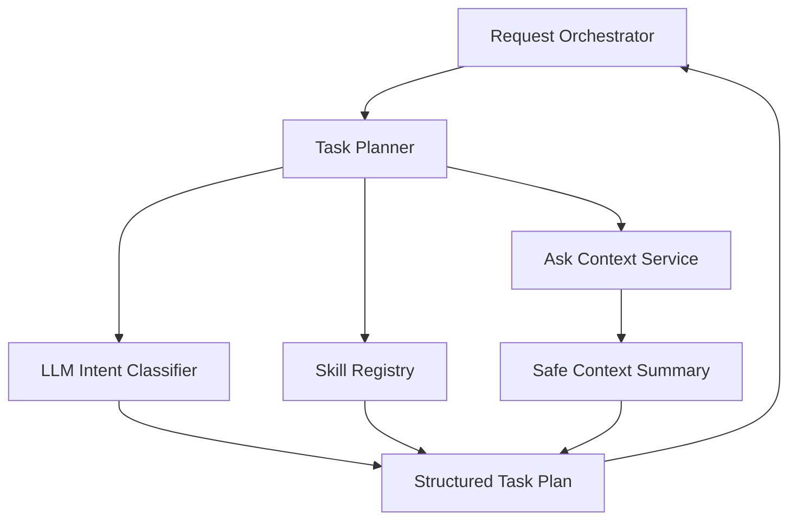

# 03. Task Planner

## Purpose

Uses an LLM to classify intent, select the right skill, and discover which personalization context may help. It returns a structured plan to the Request Orchestrator; it does not execute the task or produce the final answer.

```text
Request Orchestrator -> Task Planner -> Structured Plan -> Request Orchestrator
```

## Diagram



## Flow

The planner answers:

- what the user is trying to do
- which skill should handle it
- what personal context may help
- what is missing before the task can continue

It may ask the Context Service for safe summaries. It may recommend context, but the orchestrator decides what is authorized for execution.

## Owns

- LLM-based intent classification
- Supported versus unsupported classification
- Skill selection from planner-safe skill cards
- Read-only context discovery through approved Context Service APIs
- Missing-context and clarification detection
- Structured plan output

## Does Not Own

- Task execution or final answer generation
- Direct Hermes execution
- Direct database access
- Durable memory writes or profile updates
- Portfolio authorization
- Chat rendering or artifact persistence

## Interfaces

Input from orchestrator:

- normalized user request
- internal user identity
- active session summary when available
- planner-safe skill cards
- context access policy

Allowed context APIs:

- `get_user_profile_summary`
- `get_portfolio_availability`
- `get_portfolio_confirmation_summary`
- future domain summaries for shopping, travel, reminders, or other personal tasks

Output plan:

- status, intent, selected skill, task type
- context used for planning
- context recommended for execution
- missing context or clarification question
- unsupported reason when applicable

## Policies

- Planner uses app-approved read-only context APIs, never direct database queries
- Planner recommends useful context but does not authorize it
- Planner can recommend portfolio context but cannot approve portfolio use
- Planner must not infer durable memory or produce final recommendations
- Planner output must be structured and validated before action
- Unsupported requests return an unsupported status, not a best-effort answer
- Future skills such as shopping, travel, reminders, and portfolio review should fit the same pattern

## Examples

- Investment: select `investment_research`, check profile/portfolio availability, recommend portfolio context if useful
- Shopping: select future `shopping_research`, check safe budget/location/preference summaries, ask for missing context if needed

## Acceptance Criteria

- Natural language requests are classified before execution
- Planner selects skills from the allowed catalog
- Planner can call only approved read-only context APIs
- Planner does not access tables or write profile, portfolio, session, or memory data
- Planner can recommend portfolio context but cannot authorize it
- Planner output never serves as the final user-facing answer

## Implementation Notes

- Put planner code in `src/planning/`
- Use LLM structured output, preferably JSON validated with Pydantic
- Start with `plan(user_request, user_id, session_summary, skill_cards) -> TaskPlan`
- Planner input gets `SkillCard`, not executor `SkillConfig`
- Planner output says what context is useful, not what is authorized
- Keep statuses simple: `ready`, `needs_clarification`, `unsupported`, `needs_context_confirmation`
- Unit tests should mock the LLM and Context Service for classification, skill selection, missing context, and unsupported behavior

