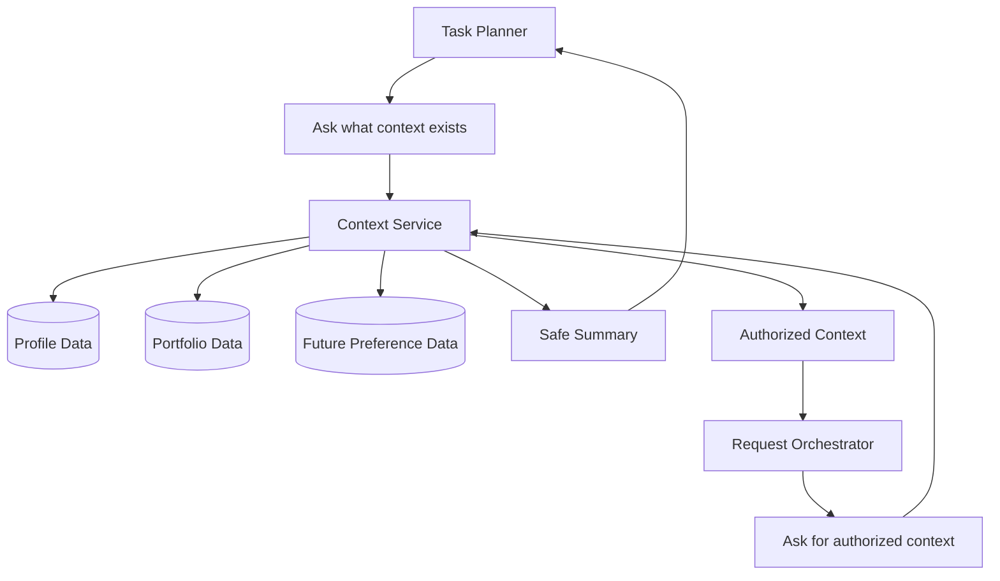

# 04. Context Service

## Purpose

Owns the application boundary for user personalization data. It gives the planner safe summaries and gives the orchestrator authorized execution context.

```text
Task Planner -> Context Service -> Safe summaries
Request Orchestrator -> Context Service -> Authorized context
```

## Diagram



## Flow

- Planning mode answers: what context exists that may help this request?
- Execution mode answers: what context is authorized to pass into the agent?

Examples: the planner can learn that profile, portfolio, shopping preferences, location, or currency exist. The orchestrator can receive profile fields automatically, but portfolio holdings only after user confirmation.

## Owns

- Read-only context APIs for planning
- Authorized context APIs for execution
- Explicit profile retrieval
- Portfolio availability and confirmation summaries
- Full portfolio retrieval only after orchestrator authorization
- Future personalization summaries for shopping, travel, reminders, and preferences
- Hiding storage details from planner, orchestrator, executor, and skills

## Does Not Own

- Task planning or skill selection
- Confirmation UX
- Chat rendering or agent execution
- Investment reasoning
- Durable memory inference
- Profile/portfolio updates from inferred behavior
- Artifact persistence

## Interfaces

Planner-facing APIs return safe summaries:

- `get_user_profile_summary`
- `get_portfolio_availability`
- `get_portfolio_confirmation_summary`
- future domain summaries

Orchestrator-facing APIs return authorized execution context:

- explicit profile context
- full portfolio context after task-specific confirmation
- future domain context when policy allows it

Return typed application objects or summaries, not raw database rows.

## Policies

- Planner may discover context through read-only summary APIs
- Planner must not receive full sensitive context unless safe for planning
- Orchestrator authorizes what context can go to execution
- Profile context is explicit durable context and may be used automatically
- Portfolio context requires task-specific confirmation
- Context Service must not infer durable preferences from chat
- Future personalization domains should be added as explicit APIs, not ad hoc database access

## Acceptance Criteria

- Planner can access safe summaries without direct table access
- Orchestrator can retrieve authorized execution context through this boundary
- Portfolio availability can be checked without exposing full holdings
- Full portfolio context is unavailable until confirmation is recorded
- Future personalization domains can be added without changing planner DB access
- Storage details remain hidden from planner, executor, skills, and chat adapters

## Implementation Notes

- Put context code in `src/context/`
- Use Postgres as source of truth for profile, portfolio, and future explicit personalization data
- Use repository-style access behind the service
- Expose two method categories: planning summaries and execution context
- Use Pydantic return models such as `ProfileSummary`, `PortfolioAvailability`, and `PortfolioConfirmationSummary`
- Execution context methods can return fuller typed objects only with orchestrator authorization
- Keep context APIs read-only for now; handle profile updates later as explicit flows
- Do not add vector or semantic memory yet
- Unit tests should verify planner APIs never expose full sensitive context and execution APIs require portfolio authorization

