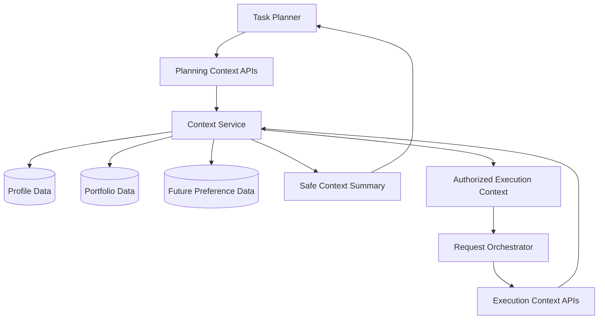

# 04. Context Service

## Purpose

The Context Service is the application boundary for user personalization data.

It gives the Task Planner safe summaries for planning and gives the Request Orchestrator authorized context for execution. This keeps the LLM smart enough to discover useful context without allowing it to query database tables directly or bypass product policy.

```text
Task Planner
-> Context Service
-> Planning-safe context summaries

Request Orchestrator
-> Context Service
-> Authorized execution context
```

## Diagram



## Responsibilities

- Expose read-only context APIs for planning
- Expose authorized context APIs for execution
- Retrieve explicit profile data
- Report portfolio availability
- Produce portfolio confirmation summaries
- Retrieve full portfolio context only after orchestrator authorization
- Provide future personalization summaries for domains such as shopping, travel, reminders, and preferences
- Keep storage details hidden from planner, orchestrator, executor, and skills
- Enforce explicit-memory rules at the context boundary

## Non-Responsibilities

- Task planning
- Skill selection
- Confirmation UX
- Chat rendering
- Agent execution
- Investment reasoning
- Durable memory inference
- Updating profile or portfolio data from inferred behavior
- Artifact persistence

## Interfaces

The planner-facing APIs should return safe summaries:

- `get_user_profile_summary`
- `get_portfolio_availability`
- `get_portfolio_confirmation_summary`
- future domain summary APIs, such as shopping or travel preference summaries

The orchestrator-facing APIs may return execution context after policy checks:

- explicit profile context
- full portfolio context only after task-specific confirmation
- future domain context only when allowed by the relevant product policy

The service should expose typed application objects or summaries, not raw database rows.

## Key Policies

- The Task Planner may discover context through read-only summary APIs
- The Task Planner must not receive full sensitive context unless that context is safe for planning
- The Request Orchestrator authorizes which context can be passed to execution
- Portfolio context requires task-specific user confirmation before execution use
- Profile context may be used automatically because it is explicit durable context
- The Context Service must not infer durable preferences from conversation
- No planner, executor, skill, or chat adapter should query personalization tables directly
- Future personalization domains should be added as explicit context APIs, not ad hoc database access

## Access Modes

Planning mode answers the question:

```text
What context exists that may help plan this request?
```

Examples:

- profile is complete
- portfolio exists
- portfolio may be relevant
- shopping preferences exist
- location or currency is available

Execution mode answers the question:

```text
What context is authorized to pass into the agent for this task?
```

Examples:

- profile fields can be included automatically
- portfolio holdings can be included only after confirmation
- future sensitive context can be included only when the relevant policy allows it

## Acceptance Criteria

- Planner can access safe context summaries through approved APIs
- Planner cannot query database tables directly
- Orchestrator can retrieve authorized execution context through the same service boundary
- Profile context is available as explicit durable context
- Portfolio availability can be checked without exposing full holdings
- Full portfolio context is unavailable for execution until user confirmation is recorded
- Future personalization domains can be added without changing planner database access
- Context Service does not write inferred preferences into durable memory
- Storage details remain hidden from planner, executor, skills, and chat adapters

