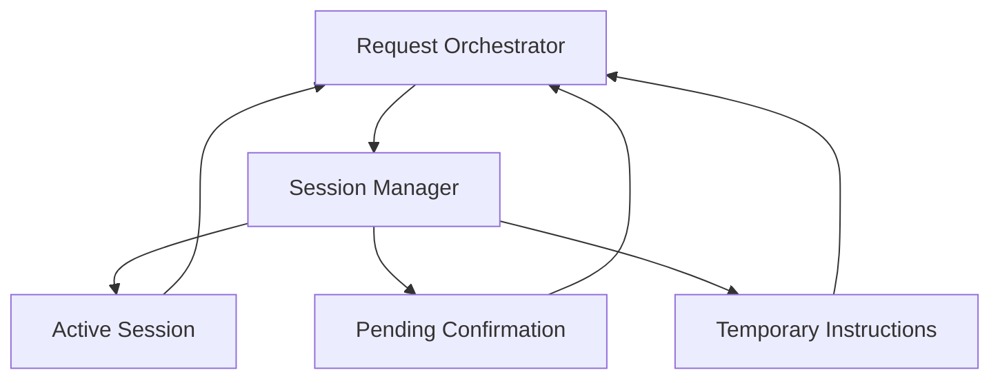

# 05. Session Manager

## Purpose

Stores temporary working state for a user: active sessions, pending confirmations, and temporary task instructions. It must not become long-term memory.

```text
Request Orchestrator -> Session Manager -> temporary session state
```

## Diagram



## Owns

- Session start, end, and expiry
- Temporary session instructions
- Pending confirmation state
- Resuming pending tasks after user action
- Clearing pending state after confirm, skip, cancel, completion, or expiry
- Keeping session state separate from durable profile and portfolio data

## Does Not Own

- Durable profile memory
- Portfolio storage
- Context discovery
- Task planning or skill selection
- Agent execution
- Artifact persistence
- Preference inference

## Interfaces

The orchestrator uses the Session Manager to:

- get, start, and end the active session
- save temporary instructions
- store, load, and clear pending confirmation state

Session records should include user identity, status, last activity time, temporary instructions, pending task state, and expiry time.

## Policies

- Session state is temporary working state, not durable memory
- Session instructions may affect only the active session
- Session instructions must not update profile fields automatically
- Starting a new session clears or replaces previous temporary state
- Ending a session clears temporary instructions and pending confirmations
- Pending confirmation state must expire
- Session Manager does not decide whether context is allowed; the orchestrator owns that policy

## Acceptance Criteria

- A user can start and end a session
- A session expires after inactivity
- Temporary instructions are available only during the active session
- Temporary instructions do not update durable profile data
- Pending confirmation state can be stored, resumed, and cleared
- Starting a new session clears previous temporary state
- Session Manager does not infer or store long-term preferences

## Implementation Notes

- Put session code in `src/session/`
- Store sessions in Postgres so restarts do not lose pending confirmation state
- Keep schema simple: `user_id`, `status`, `temporary_instructions`, `pending_state`, `last_activity_at`, `expires_at`, and timestamps
- Store `pending_state` as typed JSON for portfolio confirmation and later confirmation types
- Use Pydantic models for session state and pending state payloads
- Check expiry lazily when loading the session; no background scheduler at first
- Starting a new session should close or replace the previous active session
- Keep session writes explicit; planner and executor must not mutate session state directly
- Unit tests should cover start, end, expiry, pending confirmation save/load/clear, and replacing an active session

