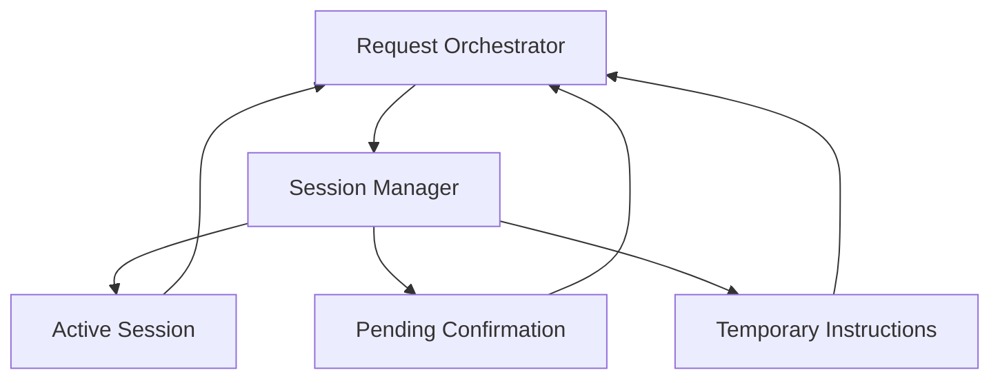

# 05. Session Manager

## Purpose

The Session Manager stores temporary working state for a user.

It supports active sessions, pending confirmations, and temporary task instructions. It must not become long-term memory.

```text
Request Orchestrator
-> Session Manager
-> temporary session state
```

## Diagram



## Responsibilities

- Start a user session
- End a user session
- Expire inactive sessions
- Store temporary session instructions
- Store pending confirmation state
- Resume pending tasks after user action
- Clear pending state after confirmation, skip, cancellation, or completion
- Keep session state separate from durable profile and portfolio data

## Non-Responsibilities

- Durable profile memory
- Portfolio storage
- Context discovery
- Task planning
- Skill selection
- Agent execution
- Artifact persistence
- Inferring user preferences

## Interfaces

The Request Orchestrator uses the Session Manager to:

- get the active session for a user
- start a new session
- end the active session
- save temporary instructions
- store pending confirmation state
- load pending confirmation state
- clear pending confirmation state

Session records should include:

- user identity
- active/inactive state
- last activity timestamp
- temporary instructions
- pending task state when applicable
- expiry timestamp

## Key Policies

- Session state is temporary working state, not durable memory
- Session instructions may affect the active session only
- Session instructions must not update profile fields automatically
- Starting a new session clears or replaces previous temporary state
- Ending a session clears temporary instructions and pending confirmations
- Pending confirmation state must expire
- Completed or cancelled tasks must clear their pending state
- The Session Manager should not decide whether context is allowed; the orchestrator owns that policy

## Example

Temporary instruction:

```text
For this session, keep answers conservative.
```

This can affect tasks in the active session.

Durable profile update:

```text
Update my risk style to conservative.
```

This is not handled as session memory. It should go through explicit profile update behavior.

## Acceptance Criteria

- A user can start and end a session
- A session expires after inactivity
- Temporary instructions are available only during the active session
- Temporary instructions do not update durable profile data
- Pending portfolio confirmation state can be stored and resumed
- Pending confirmation state is cleared after confirm, skip, cancel, completion, or expiry
- Starting a new session clears previous temporary state
- Session Manager does not infer or store long-term preferences

