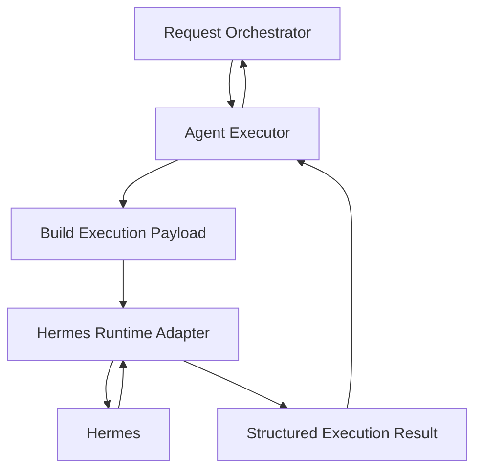

# 06. Agent Executor

## Purpose

The Agent Executor runs ready tasks.

It receives a task from the Request Orchestrator after planning, context checks, and user confirmations are complete. It prepares the agent execution request, calls Hermes through the runtime adapter, and returns a structured result.

```text
Request Orchestrator
-> Agent Executor
-> Hermes Runtime Adapter
-> Hermes
-> Agent Executor
-> Request Orchestrator
```

## Diagram



## Responsibilities

- Receive ready execution requests from the Request Orchestrator
- Build the final agent execution payload
- Select the requested skill configuration
- Call Hermes through the runtime adapter
- Capture execution status and metadata
- Return a structured execution result to the Request Orchestrator

## Non-Responsibilities

- Chat rendering
- Task planning
- Skill selection
- User confirmation
- Profile or portfolio policy
- Output validation
- Artifact persistence
- Durable memory writes

## Interfaces

Input from the Request Orchestrator:

- user request
- selected skill
- authorized context
- task constraints
- session context when available

Output to the Request Orchestrator:

- execution status
- brief or answer payload
- artifact payload when produced
- sources when produced
- diagnostics or error details

## Key Policies

- The executor receives only ready tasks
- The executor does not decide whether context is allowed
- The executor does not call the planner
- The executor does not save artifacts
- The executor does not validate final product quality
- Hermes-specific details should stay behind the runtime adapter
- The first version can run in-process as a Python class

## Acceptance Criteria

- Orchestrator can submit a ready task to the executor
- Executor calls Hermes only through the runtime adapter
- Executor returns structured status instead of raw Hermes output
- Executor does not contain task planning logic
- Executor does not contain user confirmation logic
- Executor can be split into a worker or service later without changing orchestrator behavior

## Implementation Notes

- Put executor code in `src/execution/`
- Keep the first executor in-process as a normal Python class
- Do not add a worker, queue, or separate service yet
- Use one public method like `execute(request: AgentExecutionRequest) -> AgentExecutionResult`
- Define execution request and result models with Pydantic
- Resolve executable skill config from the Skill Registry before calling the Hermes Runtime Adapter
- Pass only the authorized context received from the orchestrator
- Do not fetch extra context inside the executor
- Call only the Hermes Runtime Adapter, not Hermes directly
- Add lightweight execution metadata such as run ID, start/end timestamps, selected skill, and runtime name
- Normalize runtime failures into structured execution failures instead of raising raw provider errors up the stack
- Unit tests should fake the Skill Registry and Hermes Runtime Adapter to verify payload assembly, success handling, and failure handling
