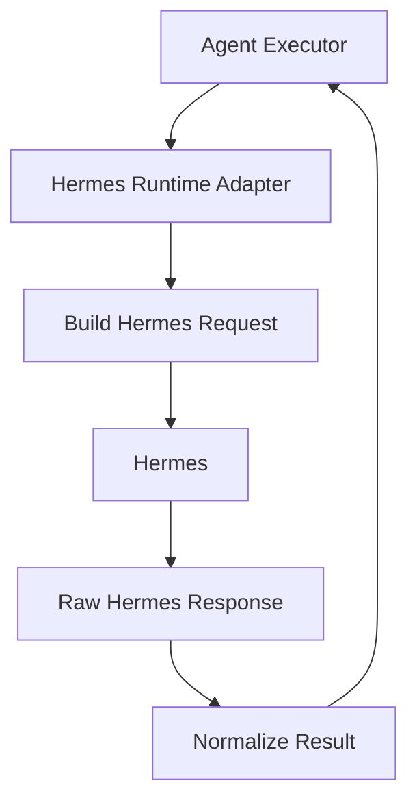

# 07. Hermes Runtime Adapter

## Purpose

The Hermes Runtime Adapter hides Hermes-specific API details behind a stable application interface.

It lets the Agent Executor run Hermes tasks without knowing Hermes transport, request format, authentication, model configuration, or response quirks.

```text
Agent Executor
-> Hermes Runtime Adapter
-> Hermes
```

## Diagram



## Responsibilities

- Convert app execution requests into Hermes-compatible requests
- Attach selected skill configuration
- Attach authorized context
- Apply model and runtime configuration
- Call Hermes
- Normalize Hermes responses into app-level execution results
- Normalize Hermes errors into app-level failure statuses
- Preserve diagnostics useful for debugging

## Non-Responsibilities

- Task planning
- Skill selection
- User confirmation
- Context authorization
- Output validation
- Artifact persistence
- Chat rendering
- Durable memory writes

## Interfaces

Input from the Agent Executor:

- app-level execution request
- selected skill
- authorized context
- task constraints
- runtime configuration

Output to the Agent Executor:

- normalized execution status
- normalized answer payload
- normalized artifact payload when available
- normalized source metadata when available
- diagnostics or structured failure details

## Key Policies

- Hermes-specific request and response formats must not leak outside this adapter
- Model and runtime switching should be configuration-driven where possible
- Malformed Hermes responses should fail closed as structured runtime failures
- Diagnostics should be preserved for logs and debugging
- User-facing error messages should be produced upstream, not by this adapter
- The first version can support one Hermes backend and one model path

## Acceptance Criteria

- Agent Executor can call one stable runtime adapter interface
- Adapter can send a valid task to Hermes
- Adapter returns normalized execution results
- Adapter converts Hermes errors into structured failures
- Adapter hides Hermes transport and payload details from the rest of the app
- No orchestrator, planner, context service, or chat gateway calls Hermes directly

## Implementation Notes

- Put Hermes adapter code in `src/runtime/hermes/`
- Keep a generic runtime interface in `src/runtime/types.py` or `src/runtime/base.py`
- Use one public method like `run(request: RuntimeRequest) -> RuntimeResult`
- Define runtime request and result models with Pydantic
- Keep Hermes auth, endpoint, model selection, and timeout config in the config layer
- Use direct tool-calling research flow first
- Use direct Research Tool Gateway calls only for research
- Expose only Research Tool Gateway tools that are allowed for the selected skill
- Convert app-level execution payloads into Hermes-specific payloads only inside this adapter
- Normalize Hermes responses into app-level runtime results before returning to the executor
- Treat malformed Hermes output as a structured runtime failure
- Include diagnostics like runtime name, model, duration, and raw error category
- Do not expose raw provider internals to users
- Research quality should come from strong model selection, skill instructions, high-quality tools, and Output Validator checks
- Unit tests should mock the Hermes client and cover request conversion, response normalization, timeout/error handling, and malformed output handling
