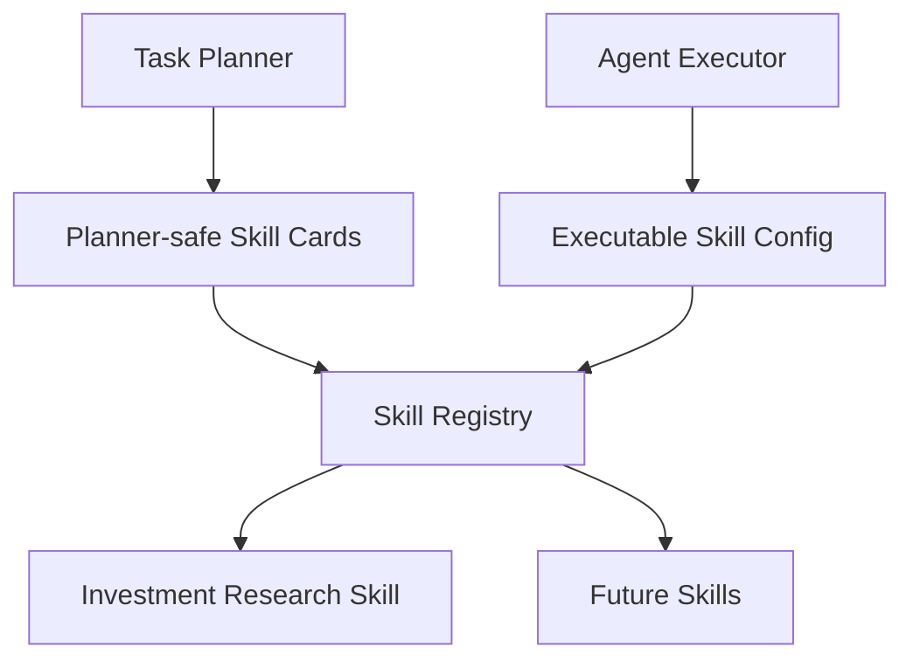

# 08. Skill Registry

## Purpose

The Skill Registry is the catalog of skills the application knows how to use.

It gives the Task Planner a planner-safe view of available skills and gives the Agent Executor the configuration needed to run the selected skill.

```text
Task Planner
-> Skill Registry
-> skill cards

Agent Executor
-> Skill Registry
-> executable skill config
```

## Diagram



## Responsibilities

- Store skill identifiers
- Store skill descriptions
- Store supported intent and task types
- Store required and optional context types
- Store Hermes skill or runtime references
- Expose planner-safe skill cards
- Expose executor-ready skill configuration
- Reject unknown or unsupported skill IDs

## Non-Responsibilities

- Task planning
- Skill execution
- Context authorization
- Chat rendering
- Durable memory
- Output validation
- Artifact persistence

## Interfaces

Planner-facing skill cards should include:

- skill ID
- short description
- supported task types
- context hints
- unsupported cases when useful

Executor-facing skill configuration should include:

- skill ID
- Hermes skill reference
- skill instruction location
- output contract
- allowed tools
- runtime defaults

## Key Policies

- Planner-facing skill cards should be compact and safe for LLM routing
- Executor-facing configuration may contain implementation details that should not be exposed to the planner
- Skill IDs should be stable application identifiers
- Unsupported skill IDs should fail before execution
- Adding future skills should not require changing the Chat Gateway or Request Orchestrator
- The registry should remain the single source of truth for skill metadata

## Example Skill Card

```text
skill_id: investment_research
description: Investment research for India and US listed equities
supported_tasks: stock analysis, comparisons, action-oriented research
context_hints: profile is useful; portfolio may be useful for personalized recommendations
```

## Acceptance Criteria

- Task Planner can request planner-safe skill cards
- Agent Executor can resolve a selected skill into executable configuration
- Skill metadata lives behind one registry boundary
- Unknown skill IDs are rejected before execution
- Adding future skills does not require changing Chat Gateway or Request Orchestrator contracts

## Implementation Notes

- Put skill registry code in `src/skills/registry.py`
- Put skill definitions under `src/skills/catalog/` or `skills/`, depending on whether they should be packaged with the app or edited as plain files
- Start with a static registry in code or YAML
- Do not add a database-backed skill registry yet
- Define two views of each skill: `SkillCard` for the planner and `SkillConfig` for the executor
- `SkillCard` should be compact and LLM-friendly: ID, description, supported tasks, context hints, and unsupported cases
- `SkillConfig` should include execution details: Hermes skill reference, instruction file path, allowed tool IDs, output contract, and runtime defaults
- Keep `investment_research` as the only registered skill first
- Use stable string skill IDs like `investment_research`, not display names
- Validate at startup that every registered skill has required fields and referenced instruction files
- Unit tests should verify skill lookup, unknown skill rejection, planner card generation, executor config generation, and startup validation
