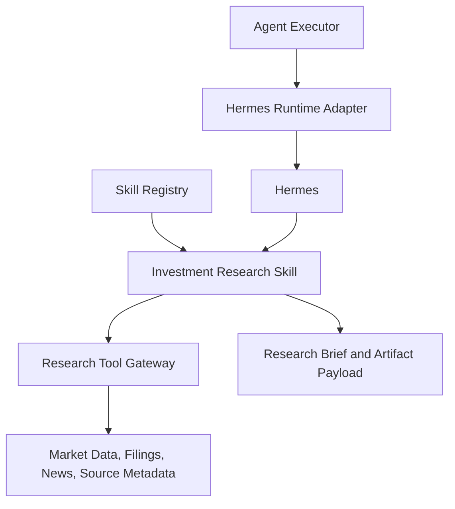

# 09. Investment Research Skill

## Purpose

Owns investment-specific research behavior: supported tasks, research standards, source expectations, output structure, and safety boundaries. Investment logic belongs here, not in app workflow layers.

```text
Skill Registry -> Investment Research Skill -> Hermes Runtime -> Research Tool Gateway
```

## Diagram



## Owns

- Supported and unsupported investment task types
- Research process and source-quality expectations
- Output structure
- Recommendation and confidence standards
- Safety boundaries and disclaimers
- Use of provided profile and portfolio context

## Does Not Own

- Chat handling
- Task planning or skill selection
- Portfolio confirmation or context authorization
- Tool implementation
- Artifact persistence
- User profile updates
- Trade execution

## Scope

Supported:

- single equity analysis
- buy, avoid, watch, or need-more-info recommendation
- comparison of multiple equities
- portfolio-aware analysis when portfolio context is provided
- capital deployment guidance within supported markets

Unsupported:

- trade execution
- tax advice
- options, futures, crypto, bonds, mutual funds, or complex ETFs
- fully autonomous investing
- guaranteed-return claims
- conclusions without enough source evidence

## Interfaces

Inputs: user request, profile context, portfolio context, task constraints, and available research tools.

Outputs: concise research brief, artifact payload, sources, recommendation, confidence, and diagnostics when research quality is limited.

## Policies

- Use only the context received
- Do not assume portfolio context when absent
- Do not request unauthorized context directly
- Do not imply portfolio-aware analysis without portfolio context
- State evidence gaps clearly instead of fabricating confidence
- Prioritize useful, evidence-backed research over speed
- Support India and US listed equities first
- Produce compact chat answers plus structured artifacts

## Acceptance Criteria

- Investment domain rules live in the skill layer
- India and US listed equities are supported
- Output includes concise evidence-backed briefs and structured artifact payloads
- Profile context is used when provided
- Portfolio context is used only when provided
- Unsupported requests are refused or narrowed clearly
- No trade execution behavior exists

## Implementation Notes

- Put skill instructions in `skills/investment_research/SKILL.md`
- Register skill ID `investment_research`
- Keep the skill broad first: stock analysis, comparisons, action recommendations, and capital deployment guidance
- Write the skill as a research playbook, not a generic prompt
- Require checklist: security resolution, business overview, recent financials, valuation context, recent developments, risks, source quality, recommendation
- Require portfolio fit analysis only when portfolio context is provided
- Use recommendation labels: `buy`, `watch`, `avoid`, `need_more_info`
- Use confidence labels: `low`, `medium`, `high`, tied to evidence quality
- Output contract should include chat brief, key reasons, key risks, recommendation, confidence, sources, and artifact payload
- Keep disclaimers short; avoid legal boilerplate
- Unit tests should validate registration, output contract expectations, unsupported handling, and portfolio-context behavior through mocked executor/runtime outputs

