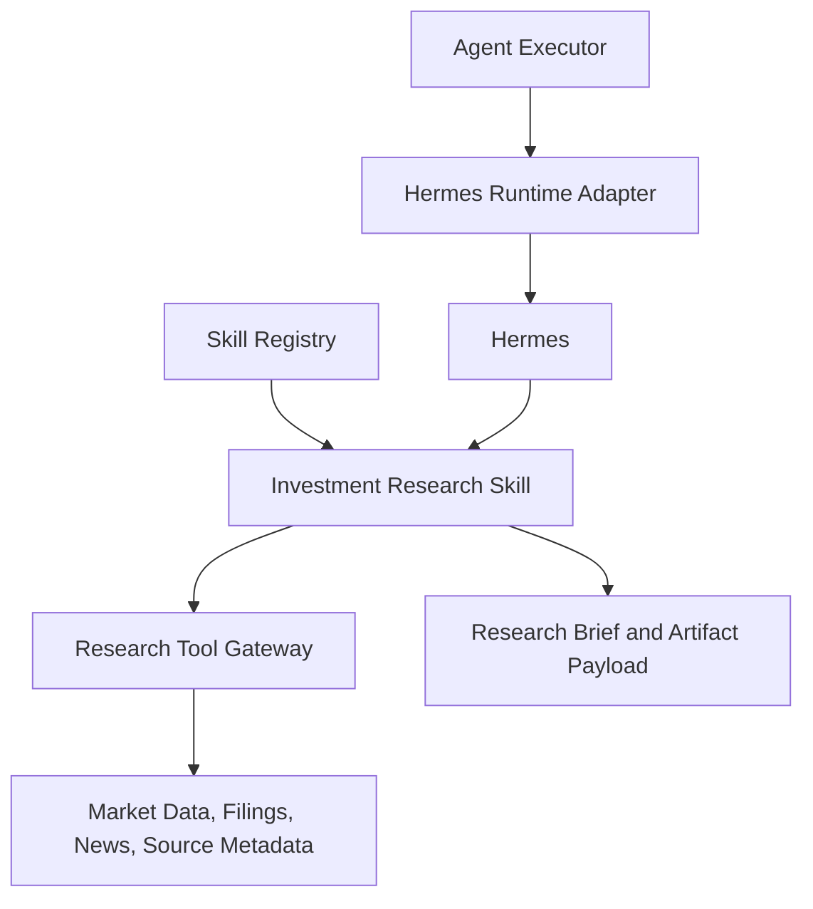

# 09. Investment Research Skill

## Purpose

The Investment Research Skill owns investment-specific research behavior.

It defines supported tasks, research standards, source expectations, output structure, and safety boundaries. Investment logic should live here, not in the Chat Gateway, Request Orchestrator, Task Planner, or Context Service.

```text
Skill Registry
-> Investment Research Skill
-> Hermes Runtime
-> Research Tool Gateway
```

## Diagram



## Responsibilities

- Define supported investment task types
- Define unsupported asset classes and requests
- Define research process expectations
- Define source quality expectations
- Define output structure
- Define recommendation and confidence standards
- Define safety boundaries and disclaimers
- Define how profile context should be used when provided
- Define how portfolio context should be used when provided

## Non-Responsibilities

- Chat handling
- Task planning
- Skill selection
- Portfolio confirmation
- Context authorization
- Tool implementation
- Artifact persistence
- User profile updates
- Trade execution

## Supported Task Types

- Single equity analysis
- Buy, avoid, or watch recommendation
- Comparison of two or more equities
- Portfolio-aware analysis when portfolio context is provided
- Capital deployment guidance within supported markets

## Unsupported Task Types

- Trade execution
- Tax advice
- Options, futures, crypto, bonds, mutual funds, or complex ETFs
- Fully autonomous investing
- Guaranteed-return claims
- Research conclusions without enough source evidence

## Interfaces

Inputs:

- user request
- profile context when provided
- portfolio context when provided
- task constraints
- available research tools

Outputs:

- concise research brief
- structured artifact payload
- source references
- recommendation or suggested action when appropriate
- confidence level
- diagnostics when research quality is limited

## Key Policies

- The skill may use only the context it receives
- The skill must not assume portfolio context when it is absent
- The skill must not request unauthorized context directly
- If portfolio context is absent, portfolio-aware analysis must not be implied
- If source quality is insufficient, the output should say so clearly
- The skill should prioritize useful, evidence-backed research over speed
- The skill should support India and US listed equities first
- The skill should produce compact answers suitable for chat while still producing structured artifacts

## Acceptance Criteria

- Investment domain rules live in the skill layer
- The skill supports India and US listed equities
- The skill produces concise evidence-backed briefs
- The skill produces structured artifact payloads
- The skill uses profile context when provided
- The skill uses portfolio context only when provided
- Unsupported requests are refused or narrowed clearly
- The skill does not contain trade execution behavior

