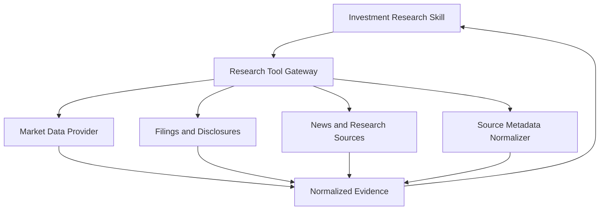

# 10. Research Tool Gateway

## Purpose

The Research Tool Gateway is the boundary between skills and external research sources.

It gives skills controlled access to market data, filings, news, and source metadata without exposing provider-specific APIs directly to the skill.

```text
Investment Research Skill
-> Research Tool Gateway
-> Market Data, Filings, News, Source Metadata
```

## Diagram



## Responsibilities

- Expose allowed research tools to skills
- Fetch market and company data
- Fetch filings and official disclosures
- Fetch relevant news and source material
- Normalize provider responses
- Return source metadata with evidence items
- Handle provider failures cleanly
- Enforce allowed markets and asset types where possible

## Non-Responsibilities

- Investment reasoning
- Recommendation generation
- Skill selection
- Context authorization
- Chat rendering
- Artifact persistence
- Durable user memory
- Portfolio storage

## Interfaces

Inputs from skills:

- research query
- target company or ticker
- market or exchange when known
- requested evidence type
- task constraints

Outputs to skills:

- normalized evidence items
- source metadata
- provider diagnostics when useful
- structured unavailable or failure states

## Key Policies

- Skills should access research sources through this gateway
- Provider-specific APIs should not leak into skill instructions
- Tool results should include source metadata suitable for artifacts
- Missing or low-quality data should be explicit
- Provider failures should return structured errors
- External data access should be read-only
- Initial supported scope should align with India and US listed equities

## Acceptance Criteria

- Investment Research Skill can request research data through one gateway boundary
- Provider-specific details are hidden from the skill
- Results include source metadata suitable for artifact citations
- Tool failures are represented as structured failures
- Unsupported markets or asset types are rejected or marked unavailable
- Gateway does not perform investment reasoning or recommendations

## Implementation Notes

- Put tool gateway code in `src/research/`
- Expose a small initial tool set: `resolve_security`, `get_quote`, `get_company_profile`, `get_financials`, `get_filings`, `get_recent_news`, and `get_peer_snapshot`
- Keep tool IDs stable because the Investment Research Skill and Hermes tool manifest will refer to them
- Use Pydantic models for tool inputs and outputs
- Every successful tool response should include source metadata and `retrieved_at`
- Return structured unavailable or error results instead of raising provider-specific errors into Hermes
- Start with provider adapters behind the gateway
- Do not put provider API details in skill instructions
- Prefer official company and filing sources for core claims
- Use news for recent developments, sentiment, and context
- Keep all tool access read-only
- Do not expose raw provider secrets to Hermes
- Unit tests should fake provider adapters and verify normalized outputs, source metadata, unsupported assets, and provider failure handling
