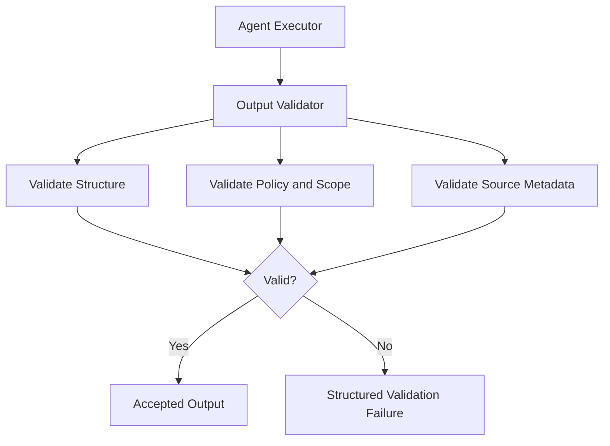

# 11. Output Validator

## Purpose

The Output Validator checks agent output before it is shown to the user or saved as a completed artifact.

It protects the product from malformed, incomplete, unsupported, or unsafe agent responses.

```text
Agent Executor
-> Output Validator
-> Request Orchestrator
```

## Diagram



## Responsibilities

- Validate expected response structure
- Validate required fields for completed research
- Validate source metadata when evidence is required
- Validate allowed status values
- Detect unsupported or unsafe output
- Return structured validation failures
- Prevent invalid outputs from being saved as completed artifacts

## Non-Responsibilities

- Investment reasoning
- Task planning
- Agent execution
- Chat rendering
- Artifact persistence
- Research tool access
- User memory writes

## Interfaces

Input:

- structured executor result
- expected output contract
- task constraints

Output:

- accepted output
- validation failure with reason and diagnostics

## Key Policies

- Completed research must include a user-facing brief
- Completed research must include source metadata when sources are required
- Invalid output must not be saved as a completed artifact
- Validator should fail closed when required structure is missing
- Validator should not rewrite substantive recommendations
- User-facing fallback messages should be produced by the orchestrator

## Acceptance Criteria

- Executor output is validated before persistence
- Missing required fields produce structured validation failures
- Unsupported status values are rejected
- Missing source metadata is rejected when evidence is required
- Invalid outputs are not saved as completed artifacts
- Validator does not perform investment reasoning

## Implementation Notes

- Put validator code in `src/validation/`
- Use Pydantic models for expected output contracts
- Define one output schema for investment research first: brief, recommendation, confidence, key reasons, key risks, sources, artifact payload, and diagnostics
- Keep recommendation labels constrained: `buy`, `watch`, `avoid`, and `need_more_info`
- Keep confidence labels constrained: `low`, `medium`, and `high`
- Validate required source metadata when the task requires evidence-backed output
- Treat malformed or missing artifact payloads as validation failures, not partial successes
- Do not rewrite the agent answer in the validator
- The validator should accept or reject with structured reasons
- The orchestrator decides whether to retry, ask for clarification, or return a failure message
- Unit tests should cover valid output, missing fields, invalid labels, missing sources, malformed artifact payload, and unsupported status
