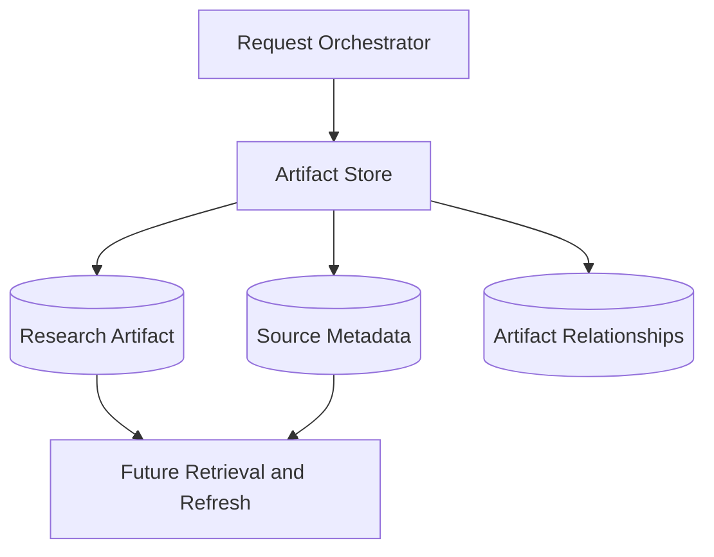

# 12. Artifact Store

## Purpose

The Artifact Store saves completed research outputs and their supporting metadata.

It preserves useful research artifacts for future retrieval, refreshes, comparisons, and follow-up workflows.

```text
Request Orchestrator
-> Artifact Store
-> Research Artifacts and Sources
```

## Diagram



## Responsibilities

- Save completed research artifacts
- Save structured artifact payloads
- Save source metadata linked to artifacts
- Preserve task metadata useful for future retrieval
- Support lookup by user and artifact ID
- Keep artifact storage separate from chat delivery

## Non-Responsibilities

- Agent execution
- Output validation
- Investment reasoning
- Source fetching
- Chat rendering
- User profile updates
- Portfolio storage

## Interfaces

Input:

- validated research output
- user identity
- task metadata
- source metadata

Output:

- artifact ID
- saved artifact metadata
- storage failure when persistence fails

## Key Policies

- Only validated completed outputs should be stored as completed artifacts
- Source metadata should be stored with the artifact
- Artifact storage failure should not pretend the artifact was saved
- Artifact Store should not decide whether research is correct
- User-facing retrieval can be added later without changing how artifacts are saved

## Acceptance Criteria

- Validated research can be saved as an artifact
- Artifact records are associated with the user
- Source metadata is linked to saved artifacts
- Invalid or failed outputs are not stored as completed artifacts
- Artifact Store does not perform validation or research reasoning

