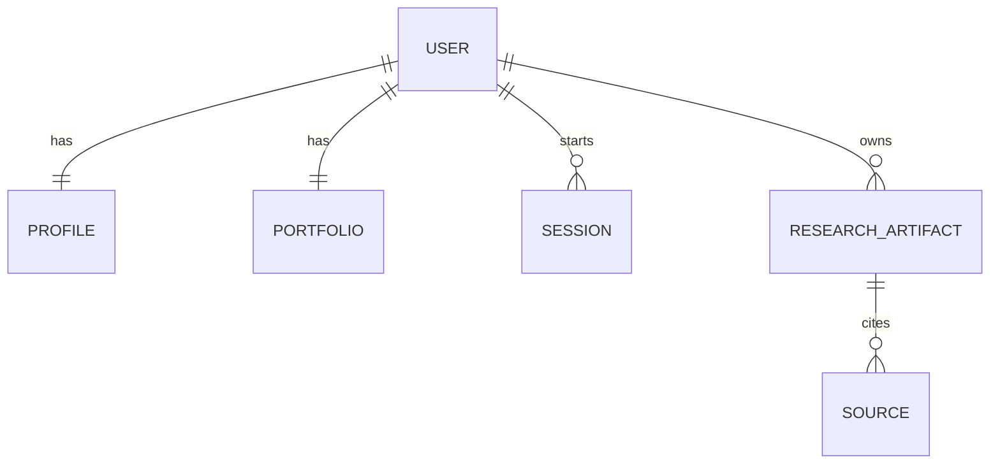

# 13. Database Schema

## Purpose

The Database Schema defines the durable storage needed by the application.

It should support user identity, explicit profile data, portfolio data, temporary sessions, research artifacts, source metadata, and basic operational records without overbuilding.

```text
Application Services
-> Database
-> Durable Product State
```

## Diagram



## Responsibilities

- Store Telegram-to-user identity mapping
- Store explicit profile fields
- Store saved portfolio holdings
- Store temporary session records
- Store pending confirmation state when needed
- Store research artifacts
- Store source metadata linked to artifacts
- Support simple audit or execution metadata when useful

## Non-Responsibilities

- Business logic
- Task planning
- Agent execution
- Research reasoning
- Chat rendering
- Inferred memory generation

## Core Entities

- `User`: internal user mapped to chat platform identity
- `Profile`: explicit durable user context
- `Portfolio`: saved holdings for optional confirmed use
- `Session`: temporary active session and pending state
- `ResearchArtifact`: completed research output
- `Source`: evidence metadata attached to artifacts

## Key Policies

- Profile data stores only explicit user-provided or user-confirmed fields
- Portfolio data is durable but must not be used without task-specific confirmation
- Session data is temporary and must not become durable memory
- Artifacts are saved after validation
- Schema should stay simple until real product needs require more structure
- Services should access tables through application boundaries, not ad hoc queries from planner or skills

## Acceptance Criteria

- Database can map a chat user to an internal user
- Database can store one profile per user
- Database can store one portfolio per user
- Database can store temporary session and pending confirmation state
- Database can store completed research artifacts and sources
- Schema supports explicit-memory rules
- Schema does not require complex retrieval, embeddings, or artifact versioning initially

## Implementation Notes

- Use Postgres as the primary database
- Use SQLAlchemy 2.x models and Alembic migrations
- Use async database access if the app runtime is async end-to-end
- Start with tables for users, profiles, portfolios, sessions, research artifacts, and sources
- Store flexible structured fields as JSONB where the shape may evolve, such as portfolio holdings, pending state, and artifact payloads
- Enforce one profile and one portfolio per user with database constraints
- Keep profile fields explicit and nullable instead of inventing defaults
- Add timestamps to all durable tables
- Do not add embeddings, vector search, artifact versioning, or complex portfolio modeling yet
- Unit tests should cover constraints, basic repository operations, and migration creation once implementation starts
