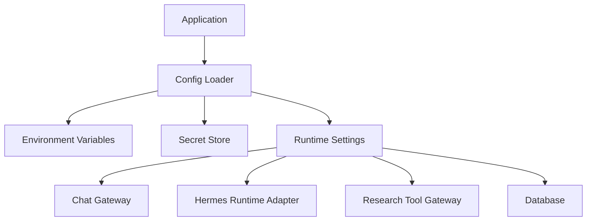

# 14. Configuration And Secrets

## Purpose

Configuration and Secrets define how the application receives environment-specific settings and sensitive credentials.

The goal is to keep runtime settings explicit, centralized, and out of source control.

```text
Application
-> Config Layer
-> Environment Variables and Secret Store
```

## Diagram



## Responsibilities

- Define required environment variables
- Load non-secret runtime configuration
- Load secret credentials from the deployment environment
- Configure Telegram bot access
- Configure database access
- Configure Hermes runtime access
- Configure research provider access
- Configure model/runtime defaults where needed

## Non-Responsibilities

- Secret rotation workflows
- Business logic
- Task planning
- Agent execution
- Chat rendering
- Database schema design

## Configuration Areas

- chat platform credentials
- database URL
- Hermes runtime endpoint and credentials
- model/runtime defaults
- research provider credentials
- logging level
- environment name

## Key Policies

- Secrets must not be committed to the repository
- Local development should use local environment files or shell environment variables
- Production secrets should come from the deployment secret manager
- Config loading should fail clearly when required settings are missing
- Runtime model/provider choices should be configurable where practical
- Application code should read configuration through one config boundary

## Acceptance Criteria

- Required settings are documented
- Missing required settings fail with clear errors
- Secrets are not stored in source control
- Telegram, database, Hermes, and research provider settings have clear config homes
- Application modules do not read unrelated environment variables directly

