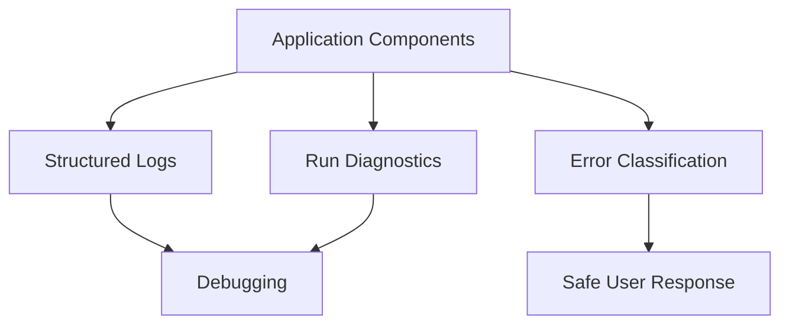

# 15. Observability And Errors

## Purpose

Observability and Errors define how the application records useful runtime information and handles failures.

This should stay simple: structured logs, clear error categories, and enough diagnostics to debug failed requests.

```text
Application Components
-> Logs and Error Handling
-> Debuggable Operations
```

## Diagram



## Responsibilities

- Define consistent logging conventions
- Capture request and execution IDs where useful
- Record planner, executor, runtime, validation, and persistence failures
- Classify expected error types
- Return safe user-facing errors through the orchestrator
- Preserve diagnostics for debugging

## Non-Responsibilities

- Complex distributed tracing
- Heavy metrics infrastructure
- Alerting workflows
- Agent reasoning
- Validation policy
- Artifact persistence

## Error Categories

- user input error
- unsupported request
- missing required context
- planner failure
- runtime failure
- validation failure
- persistence failure
- provider unavailable

## Key Policies

- Logs should contain enough context to debug without exposing secrets
- User-facing errors should not expose stack traces or provider internals
- Expected failures should be represented as structured statuses where possible
- Unexpected failures should be logged and converted into safe fallback responses
- Failure to save an artifact should not be reported as a successful save
- Observability should start simple and grow only when needed

## Acceptance Criteria

- Major components log meaningful failures
- Errors are converted into safe user-facing responses
- Runtime and provider failures include useful diagnostics for debugging
- Secrets are not written to logs
- Validation and persistence failures are distinguishable
- The app remains understandable without heavy observability infrastructure

